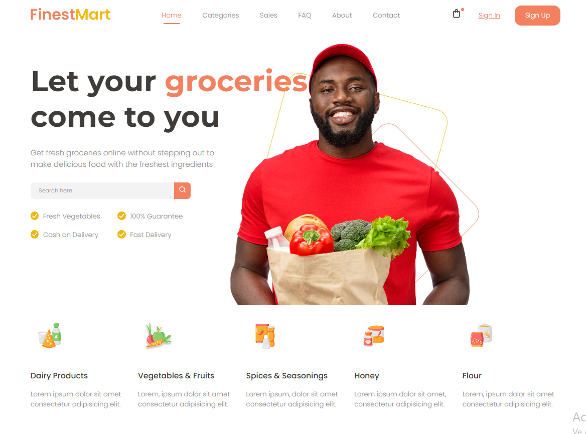

# SASS Vite Grocery Store

This is a frontend project built with HTML, CSS (using Sass), and Vite.  
It features a **header** and **hero section** for a Grocery Store website.

## 🖥 Preview



## 🚀 Technologies Used

- HTML5
- CSS3 (Sass)
- Vite (as development build tool)

## 🚀 Setup Instructions

To run this project locally, follow these steps:

1. **Clone the repository:**
   ```bash
   git clone https://github.com/Frenchitas/SASS-Vite-Grocery-Store.git

2. **Navigate into the project directory:**
   ```bash
   cd SASS-Vite-Grocery-Store

3. **Install dependencies (make sure you have Node.js and npm installed):**
   ```bash
   npm install

4. **Start the development server:**
    ```bash
   npm run dev
Your project should now be running at http://localhost:5173/ (or another port if already in use).
